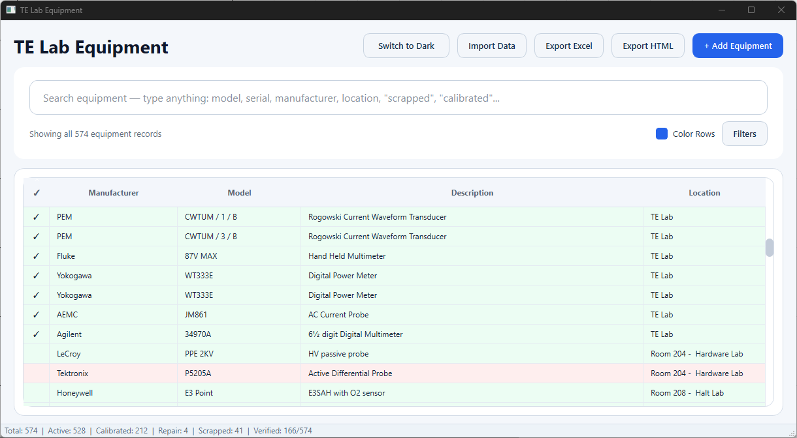

# ME Lab Inventory App Brief

This folder captures the initial direction for an `ME_Lab` version of the inventory system.

## Goal

Create a Machine Shop / ME inventory app that reuses the shared inventory system structure, while tailoring the fields and workflow to machine-shop materials and equipment.

## Source Inputs

- Primary source reference: Aditya's Excel file, `Machine Shop Material List`
- Planned app storage location: `S:\Engineering\Public`
- Long-term structure: keep multiple app variants together, such as `TE`, `ME`, `IT`, and others

## Planned Core Fields

The ME app should track at least:

- quantity
- manufacturer
- model
- description
- box number
- location

## Planned User Experience

- Show inventory in a searchable table view
- Let users double-click an entry to open a detailed record view
- Include a place in the detailed view for an item picture
- Keep the detailed Excel export already available in the current system
- Keep HTML output external or easily generated so it can be customized per use case

## Search And Filtering Expectations

- Search should work across all meaningful record data
- Existing TE behavior suggests search may not currently match everything users expect
- Example concern: searching `TE Lab` does not appear to filter correctly today

## Possible ME-Specific Enhancements

- Add per-project separation
- This could be implemented as:
  - another column
  - a grouping field
  - a visual divider in the UI or report output

## Reference UI

`App.png` appears to be a TE Lab UI reference screenshot for the kind of desktop workflow this ME version should follow.

## Open Questions

- Is `Machine Shop Material List` enough by itself, or will ME also need a second import source like TE does?
- Should `box number` be its own dedicated field in the shared schema, or only an ME-specific field?
- Should per-project separation affect only filtering and exports, or also the on-screen layout?
- Should pictures be stored as file paths, copied assets, or links to a shared drive location?
